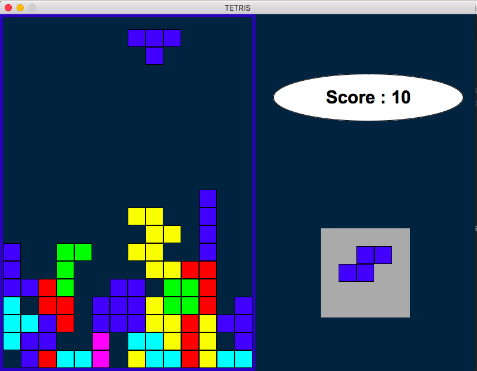

# Tetris
A tetris game implemented using C++ and FLTK.

## Compilation (OSX)
`g++ tetrisfinal.cpp fltk-config --use-forms --use-gl --use-images --ldstaticflags --cxxflags` 

## Running: 
`./ouput`

## Functionalities
- A piece with a randomized color and type is generated periodically and it moves down the playing area. User can control the orientation and
position of the piece using arrow keys until the current piece reaches the bottom of the playing board. At this point a new piece is generated.
- User cannot move or orient a piece in the following situations:
    - The piece tries to move out of the playing board area as a result of the user’s action
    - If there is another piece already blocking it’s movement
    
- Exceptions are thrown if the above cases are encountered. The error is
caught and the playing board border turns red, indicating to the user
that his move is invalid and prevents the piece from making that
move.
- If the user is able to form a straight line with a set of pieces, the
scoreboard is updated and the said line is deleted from the playing board.
- If any piece touches the top of the playing board and no straight line is
formed, the game ends.

## User Interactions
The user can interact using the following keys
- ESC : End Game and Close Window
- Up Arrow Key: Rotate current piece clockwise
- Down Arrow Key: Rotate current piece counter-clockwise
- Left Arrow Key: Move current piece left
- Right Arrow Key: Move current piece right
- Space Bar: Bring current piece to the bottom of the playing area.

## Screenshots

